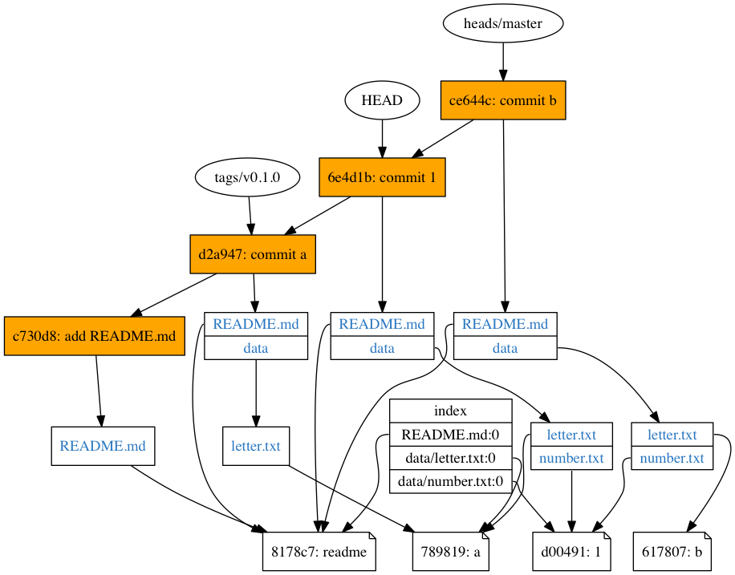

# git-show-objects自述文档

> git-show-objects是git的一个扩展命令，旨在展示git中的objects及其相互关系。

> 现在还不支持解析gc后的压缩包。

## 依赖

* ImageMagic: 用来将生成的dot文件转化为png图片
* open: mac命令，打开png图片预览

## 特性

* [x] 支持对象的显示
* [x] 支持对象关系的显示
* [x] 支持生成png并显示
* [x] 支持index显示
* [x] 支持分支显示

## 截图

## 安装

1. 克隆仓库

        git clone git@github.com:pysnow530/git-show-objects.git

2. 将仓库目录添加到PATH

        # 将仓库目录添加到PATH环境变量
        echo 'export $PATH=REPO_PATH:$PATH' >>~/.profile

        # 或者做个软链
        ln -s REPO_PATH/git-show-objects /usr/local/bin/

3. 使用

        cd some_repo
        git show-objects
